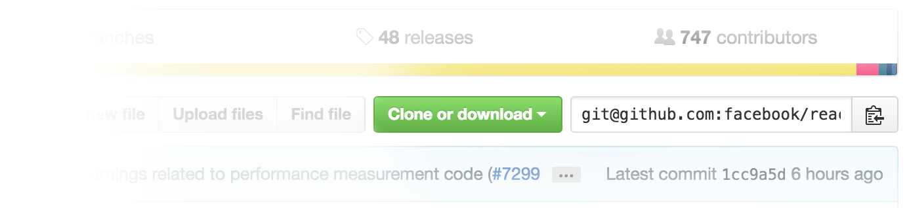

# Chrome 1-Click GitHub Link Extension

Bringing back the 1-click repo link feature to Github. Because that one extra click needed nowadays is just too much! If you want to use it, you can either go to Chrome Web Store and [install it right away](https://chrome.google.com/webstore/detail/show-github-repo-link/adnoeaihckmbmiedljgdljofehljdlnk) or:

1. Clone the repo
2. Go to (chrome://extensions)[chrome://extensions]
3. Click *Load unpacked extension* and add the the `src` folder

